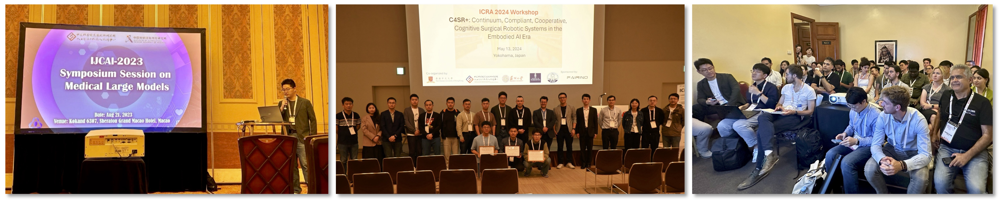

<!--   
<b>Services: </b>
  
<ul>
<li>2024: TPC member of MobiCom 2025</li>
<li>2024: TPC member of DCOSS-IoT 2025</li>
<li>2024: TPC member of MobiCom PICASSO Workshop 2024</li>
<li>2024: TPC member of MobiSys BodySys Workshop 2024</li>
<li>2024: TPC member of MobiCom Artifact Evaluation 2024</li>
<li>2024: TPC member of DCOSS-IoT 2024</li>
<li>2024: TPC member of WiSec 2024</li>
<li>2024: TPC member of ICDCS 2024</li>
<li>2023: Co-Chair of Workshop on Emerging Physical-layer Security Technologies and Applications for BG5 and 6G</li>
<li>2023: TPC member of IoTDI 2024</li>
<li>2023: TPC member of IPSN 2024</li>
<li>2023: TPC member of DCOSS-IoT 2023</li>
<li>2023: TPC member of ICDCS 2023</li>
<li>2022: TPC member of IPSN 2023</li>
<li>2022: TPC member of ICPADS 2022</li>
<li>2022: TPC member of SECON 2022</li>
<li>2022: TPC member of Workshop on Smart Wearable Systems and Applications (SmartWear) 2022</li>
<li>2022: TPC member of GLOBECOM 2022</li>
<li>2022: TPC member of EWSN 2022</li>
<li>2022: Social Media Chair of Mobicom 2022</li>
<li>2021: TPC member of Mobiquitous 2021</li>
<li>2021: TPC member of CHASE 2021</li>
<li>2021: Co-Chair of Workshop on Combining Physical and Data-Driven Knowledge in Ubiquitous Computing 2021</li>
<li>2021: TPC member of Workshop on VNI: Virtualization for Enabling Next-Generation IoT Networks</li>
<li>2021: TPC member of Workshop on Combining Physical and Data-Driven Knowledge in Ubiquitous Computing 2020</li>
<li>2021: TPC member of the First International Workshop on Cyber-Physical-Human System Design and Implementation (CPHS 2021)</li>
<li>2020: Publicity chair of Buildsys 2020</li>
<li>2020: TPC member of COMSNET 2021</li>
<li>2020: TPC member of IEEE EWSN 2020</li>
<li>2020: TPC member of IEEE ICARM (International Conference on Advanced Robotics and Mechatronics) 2020</li>
<li>2020: TPC member of ACAIT (Asian Conference on Artificial Intelligence Technology) 2020</li>
<li>2020: TPC member of IoTDI 2020</li>
<li>2018: TPC member of IEEE EWSN CoWireless Workshop</li>
<li>2016: TPC member of EWSN Posters&Demos</li>
<li>2011-2012: Chairman of IEEE Shandong University Student Branch</li>
</ul> -->

 
<b>Grant Reviewers </b>
<ul>
<li>Education Research Funding Programme (ERFP), Ministry of Education, Singapore</li>
</ul>

 
<b>Program Committees </b>
<ul>
<li><b>Aera Chair</b> of MICCAI 2024</li>
<li><b>Chair</b> of MICCAI 2024 Workshop on Embodied AI and Robotics for Healthcare (EARTH)</li> 
<li><b>Chair</b> of ICRA 2024 Workshop on Continuum, Compliant, Cooperative, Cognitive Surgical Robotic Systems in the Embodied AI Era (C4SR+)</li> 
<li><b>Chair</b> of IJCAI 2023 Symposium Session on Medical Large Models</li> 
<li><b>Chair</b> of IEEE MedAI 2024 Special Session on Embodied AI for Medical Robots</li> 
<li>TPC of International Joint Conference on Artificial Intelligence (IJCAI 2023&2024)</li> 
<li>TPC of IEEE International Conference on Bioinformatics and Biomedicine (BIBM 2024)</li> 
<li>TPC of MICCAI Distributed, Collaborative and Federated Learning (DeCaF) Workshop (2022&2023)</li>
<li>TPC of MICCAI 2021 Deep Generative Models (DGM) Workshop</li> 
</ul>

 
<b>Regular Journal Reviewers </b>
<ul>
<li>Medical Image Analysis (MedIA)</li> 
<li>IEEE Transactions on Medical Imaging (TMI)</li>
<li>IEEE Transactions on Image Processing (TIP)</li> 
<li>IEEE Transactions on Neural Networks and Learning Systems (TNNLS)</li>
<li>International Journal of Computer Vision (IJCV)</li> 
<li>IEEE Transactions on Information Forensics and Security(TIFS)</li> 
<li>IEEE Transactions on Circuits and Systems for Video Technology (TCSVT)</li> 
<li>IEEE Transactions on Industrial Informatics (TII)</li> 
<li>IEEE Transactions on Computational Imaging (TCI)</li> 
<li>IEEE Transactions on Audio, Speech and Language Processing (TASL)</li> 
<li>IEEE Journal of Biomedical and Health Informatics (JBHI)</li> 
<li>IEEE Open Journal of Engineering in Medicine and Biology</li> 
<li>Artificial Intelligence in Medicine</li> 
<li>Neural Networks</li>
</ul>

 
<b>Regular Conference Reviewers </b>
<ul>
<li>International Conf. on Medical Image Computing and Computer Assisted Interventions (MICCAI)</li>
<li>The Conference on Neural Information Processing Systems (NeurIPS)</li>
<li>IEEE Conference on Computer Vision and Pattern Recognition (CVPR)</li>   
<li>IEEE International Conference on Computer Vision (ICCV)</li> 
<li>The European Conference on Computer Vision (ECCV)</li> 
<li>The Asian Conference on Computer Vision (ACCV)</li> 
<li>International Joint Conference on Artificial Intelligence (IJCAI)</li>
<li>IEEE International Conference on Robotics and Automation (ICRA)</li> 
<li>IEEE/RSJ International Conference on Intelligent Robots and Systems (IROS)</li> 
<li>IEEE International Conference on Bioinformatics and Biomedicine (BIBM)</li> 
<li>IEEE International Symposium on Biomedical Imaging (ISBI)</li> 
<li>IEEE International Conference on Acoustics, Speech & Signal Processing (ICASSP)</li>  
</ul>

 
    
   Organize workshops on IJCAI-2023 Medical Large Models, ICRA-2024 C4SR+, and MICCAI-2024 EARTH

<!--   
<b>Invited Talks: </b>
  
<ul>
<li>2019.05  "Smart Sensing and Security System for IoT " at Early Career Research Seminar, University of New South Wales, Australia.</li>
<li>2019.04  "Sensor-Assisted Smart Recognition System on Wearable Devices" at City University of Hong Kong, China</li>
<li>2017.10  "Sensor-Assisted Face Recognition System on Smart Glass" at Shenzhen University, China</li>
<li>2016.11  "Biometric-based Recognition System on Wearable Devices " at NICTA Australia</li>
</ul> -->

