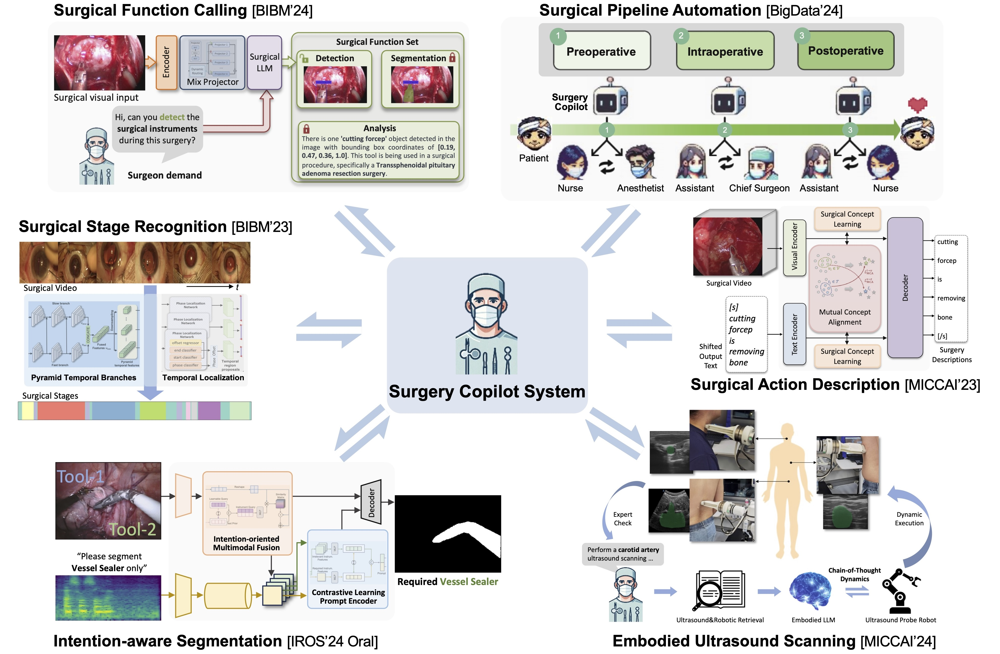

---
title:
layout: docs  # Do not modify.

# Optional header image (relative to `static/img/` folder).
header:
  caption: ""
  image: ""
---

<h2><b>Human Healthcare Pipeline</b></h2>

The research aligns with human healthcare pipeline, including the clinical diagnosis, surgery intervention and medical foundation models. With the multimodal medical data from patient examinations, our research can assist clinicans with diagnosis and assist surgeons with surgery. In particular, our research on medical multimodal foundation models can futher support the entire healthcare pipeline.

<h2><b>Multimodal Clinical Diagnosis</b></h2>

Our research targets at the multimodal clinical diagnosis though AI training pipeline. The research focuses on addressing significant clinical challenges caused by imperfect medical data, including the low-quality, modality-missing data, decentralized data, and coarse/noisy annotations. The research has been verified on diverse modalities, such as endoscopy, dermoscopy, pathology, radiology, and genetics, etc

Selected Publications
<ul>
<li>[MedIA'23] Medical Federated Learning with Joint Graph Purification for Noisy Label Learning</li>
<li>[TMI'22] Personalized Retrogress-Resilient Federated Learning Towards Imbalanced Medical Data</li>
<li>[MICCAI'22] Discrepancy and Gradient-guided Multi-modal Knowledge Distillation for Pathological Glioma Grading (MICCAI Young Scientist Award, Oral)</li>
<li>[AAAI'21] Diagnose Like A Pathologist: Weakly-Supervised Pathologist-Tree Network for Slide-Level Immunohistochemical Scoring</li>
<li>[TMI'21] Super-Resolution Enhanced Medical Image Diagnosis with Sample Affinity Interaction</li>
</ul>

<h2><b>Surgery Intervention Assistance</b></h2>

Selected Publications
<ul>
<li>[MICCAI'24] Transforming Surgical Interventions with Embodied Intelligence for Ultrasound Robotics (Oral)</li>
<li>[IROS'24] ASI-Seg: Audio-Driven Surgical Instrument Segmentation with Surgeon Intention Understanding (Oral)</li>
<li>[BigData'24] SurgBox: Agent-Driven Operating Room Sandbox with Surgery Copilot</li>
<li>[BIBM'24] SurgFC: Multimodal Surgical Function Calling Framework on the Demand of Surgeons</li>
<li>[MICCAI'23] Surgical Video Captioning with Mutual-Modal Concept Alignment (Early accepted)</li>
</ul>

<h2><b>Medical Foundation Models</b></h2>

Selected Publications
<ul>
<li>[NeurIPS'24] Flaws can be Applause: Unleashing Potential of Segmenting Ambiguous Objects in SAM</li>
<li>[JBHI'24] Unified Multi-modal Diagnostic Framework with Reconstruction Pre-training and Heterogeneity-combat Tuning</li>
<li>[MICCAI'24] EndoUIC: Promptable Diffusion Transformer for Unified Illumination Correction in Capsule Endoscopy</li>
<li>[MICCAI'24] Endora: Video Generation Models as Endoscopy Simulators</li>
<li>More research coming soon ...</li>
</ul>

              
