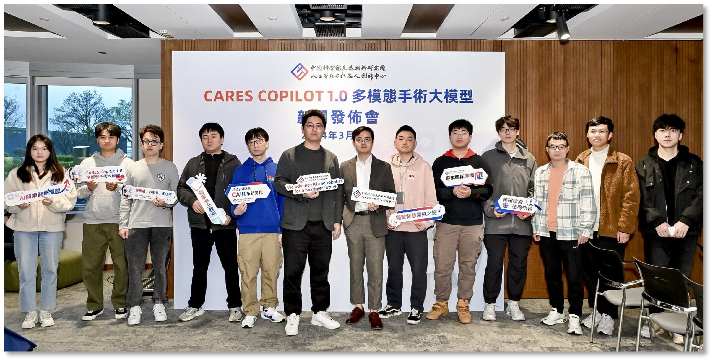

---
title:
layout: docs  # Do not modify.

# Optional header image (relative to `static/img/` folder).
header:
  caption: ""
  image: ""
---

 
<h2><b>Alumni</b></h2>
<ul>
<li><a href="https://helenypzhang.github.io/">Yupei Zhang</a> (RA, 2022-2024; PhD candidate at University of Cambridge)</li>
<li><a href="https://scholar.google.com/citations?hl=zh-CN&user=IzA-Ij8AAAAJ&view_op=list_works&authuser=1&sortby=pubdate">Qing Xu</a> (RA, 2023-2024; PhD candidate at The University of Nottingham Ningbo China)</li>
<li>Xingjian Luo</a> (RA, 2023-2024; PhD candidate at The Chinese University of Hong Kong)</li>
<li>Zhen Sun</a> (RA, 2023-2024; PhD candidate at Hong Kong University of Science and Technology (Guangzhou))</li>
<li><a href="https://zikunliu6.github.io/">Zikun Liu</a> (RA, USTC Gifted Young, 2018-2019; PhD candidate at University of Illinois at Urbana-Champaign)</li>
</ul>
 

 
    
   Our research team to develop the multimodal surgery copilot system from zero to one

